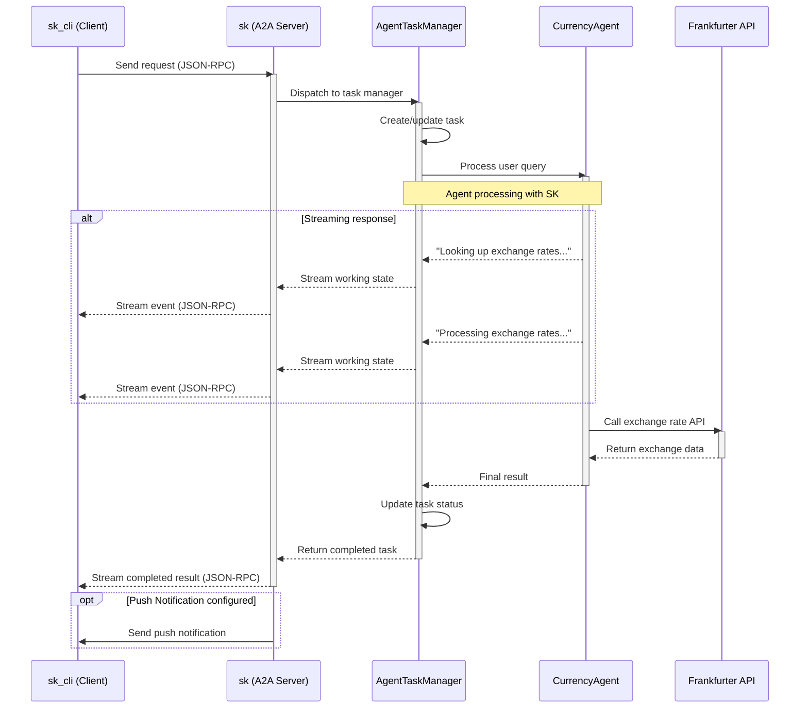

# A2A Protocol Implementation with Semantic Kernel

This project implements the A2A (Agent-to-Agent) 🤖🤝🤖 protocol using Microsoft's Semantic Kernel framework. The A2A protocol, proposed by Google, is designed as a communication protocol between AI agents.

## Project Structure

```
├── common/       # A2A protocol server/client 
├── sk/           # A2A agent implementation using Semantic Kernel
├── sk_cli/       # A2A client sending a query to A2A agent
├── sample/       # LangGraph sample (official implementation of A2A), which this project is based on.
```

## A2A Protocol Flow



## Setup

1. Create and activate the virtual environment:
```
python -m venv venv
# On Windows
venv\Scripts\activate
# On Unix or MacOS
source venv/bin/activate
```

2. Install the required dependencies:
```
pip install poetry
poetry install
```

3. Configure environment variables:
```
# Create a .env file with the following variables
AZURE_OPENAI_API_KEY=your_api_key
AZURE_OPENAI_ENDPOINT=your_endpoint
AZURE_OPENAI_DEPLOYMENT_NAME=your_deployment_name
```

## Usage

1. Start the A2A Agent Server:

```bash
python sk_main.py
```

2. Send requests to the agent using the client:

```bash
python sk_cli_main.py
```

### Client CLI Examples

#### Example:

```cmd
=========  starting a new task ======== 
What do you want to send to the agent? (:q or quit to exit): How much is 100 USD in JPY?
stream event => {"jsonrpc":"2.0","id":"a2720b1bb297480a81a87914327b7fd8","result":{"id":"94a11ef59e724e21ab8be340f7df598f","status":{"state":"working","message":{"role":"agent","parts":[{"type":"text","text":"Looking up the exchange rates..."}]},"timestamp":"2025-04-16T16:21:05.490205"},"final":false}}
stream event => {"jsonrpc":"2.0","id":"a2720b1bb297480a81a87914327b7fd8","result":{"id":"94a11ef59e724e21ab8be340f7df598f","status":{"state":"working","message":{"role":"agent","parts":[{"type":"text","text":"Processing the exchange rates..."}]},"timestamp":"2025-04-16T16:21:14.840555"},"final":false}}
stream event => {"jsonrpc":"2.0","id":"a2720b1bb297480a81a87914327b7fd8","result":{"id":"94a11ef59e724e21ab8be340f7df598f","artifact":{"parts":[{"type":"text","text":"100 USD is equivalent to 14,293 JPY at the current exchange rate."}],"index":0,"append":false}}}
stream event => {"jsonrpc":"2.0","id":"a2720b1bb297480a81a87914327b7fd8","result":{"id":"94a11ef59e724e21ab8be340f7df598f","status":{"state":"completed","timestamp":"2025-04-16T16:21:14.842574"},"final":true}}
```

## Resources

- [Semantic Kernel Documentation](https://learn.microsoft.com/en-us/semantic-kernel/)
- [A2A Protocol Specification](https://github.com/google/A2A/)

